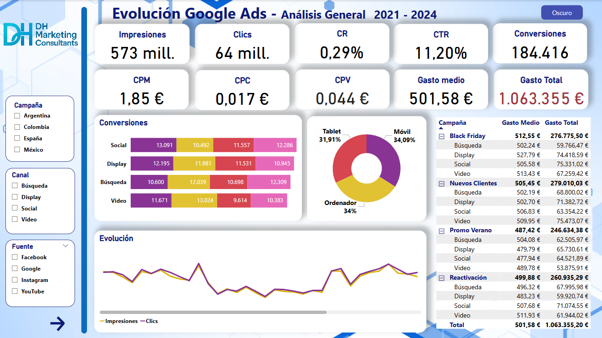

# MarketingPBI

¡Hola! Este repositorio contiene mi dashboard de marketing hecho en Power BI.

🎯 **Demo en vivo:** <https://silviagaren.github.io/MarketingPBI/>

---

## Descripción

- **Objetivo:** Analizar campañas y embudos de conversión.  
- **Datos:** Simulados/anonimizados.  
- **Herramientas:** Power BI Desktop, DAX, Power Query.

## Cómo abrir el .pbix

1. Descarga `MarketingPBI.pbix` desde la sección *Releases* o haciendo clic aquí.  
2. Abre con Power BI Desktop (versión 2.130 o posterior).

## Licencia

MIT — libre para uso educativo y portafolios.
